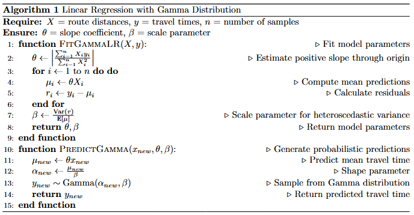
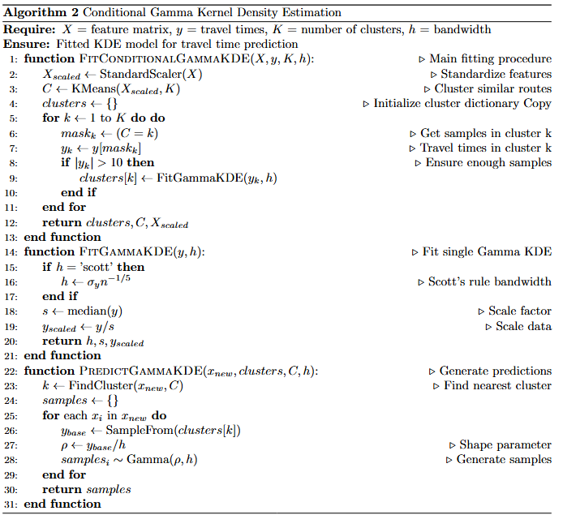
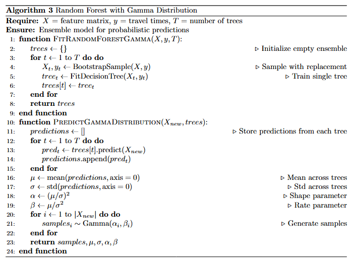
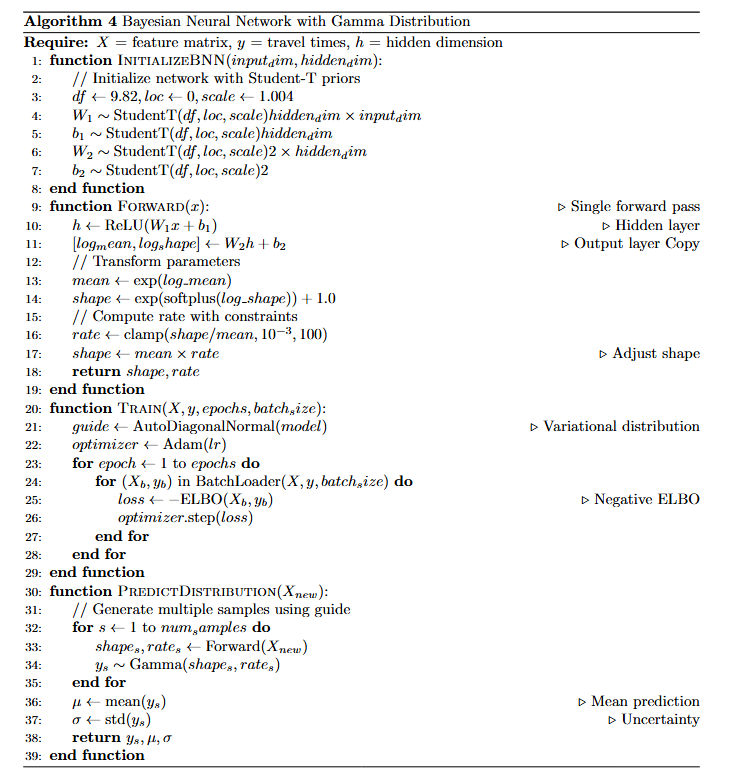

# Probabilistic Models of Travel Times in Shared Mobility

This repository contains the implementation of probabilistic machine learning models for analyzing travel time variability in Shared Mobility Services (SMS) and evaluating its impact on accessibility. The research focuses on comparing different ML approaches to predict travel time distributions and assess transportation accessibility in low-density areas.

## Overview

This project addresses the challenges of evaluating accessibility in Shared Mobility Services by:
- Implementing probabilistic ML models to predict travel time distributions
- Creating time-expanded graphs for accessibility analysis
- Combining conventional public transport and SMS networks
- Evaluating accessibility improvements in low-density areas using [CityChrone](http://citychrone.org/)


## Models 

The following probabilistic ML models are implemented to learn travel time distributions:

1. **Linear Regression with Gamma Distribution (LRGD)**
   - Basic linear regression predicting Gamma distribution mean
   - Uses route distance as single feature


2. **Conditional Kernel Density Estimation (CKDE)**
   - Non-parametric method grouping similar routes
   - Fits Gamma kernels to each group's travel times


3. **Random Forest Regressor with Gamma Distribution (RFRGD)**
   - Combines multiple trees for Gamma distribution fitting
   - Uses shape α = (µ/σ)² and rate β = µ/σ² parameters


4. **Bayesian Neural Network (BNN)**
   - Two-layer neural network with Student's t-distribution priors
   - Estimates Gamma distribution parameters using ELBO loss



## Key Features

- **Travel Time Analysis**: Captures day-to-day, within-the-day, and vehicle-to-vehicle variability
- **Accessibility Calculation**: Uses isochrone-based measures with hexagonal grid tessellation
- **Time-Expanded Graphs**: Combines CPT and SMS networks for comprehensive accessibility analysis
- **Walking Integration**: Incorporates walking as a transportation mode with configurable parameters

## Installation

```bash
# Clone the repository
git clone https://github.com/your-username/reliable-accessibility-framework.git

# Navigate to project directory
cd reliable-accessibility-framework

# Install required dependencies
pip install -r requirements.txt
```


## Data Requirements

The framework expects the following data:
- SMS trip data with timestamps and geolocation
- GTFS data for conventional public transport
- Opportunity locations (schools, workplaces, etc.)
- Area tessellation into hexagonal grid cells

## Performance Metrics

Models are evaluated using multiple metrics:
- Mean Absolute Error (MAE)
- Root Mean Squared Error (RMSE)
- Negative Log-Likelihood (NLL)
- Kullback-Leibler Divergence (KLD)


## Contributing

Contributions are welcome! Please feel free to submit a Pull Request. For major changes, please open an issue first to discuss what you would like to change.

## Acknowledgments

This work has been funded by Région Île-de-France. Data was provided by Padam Mobility.

